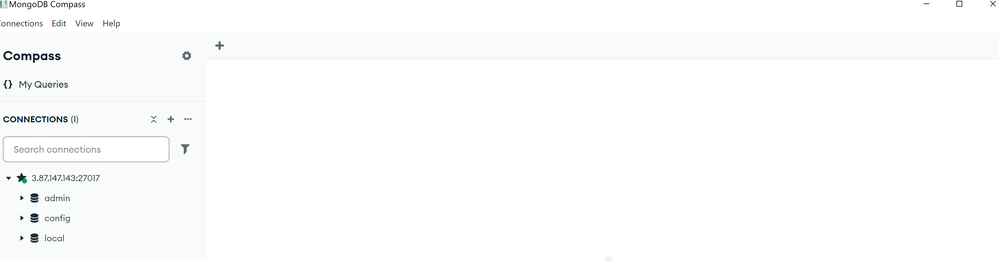
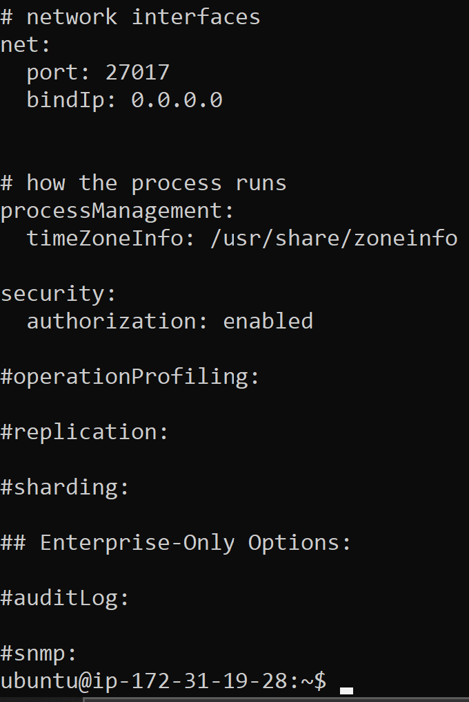
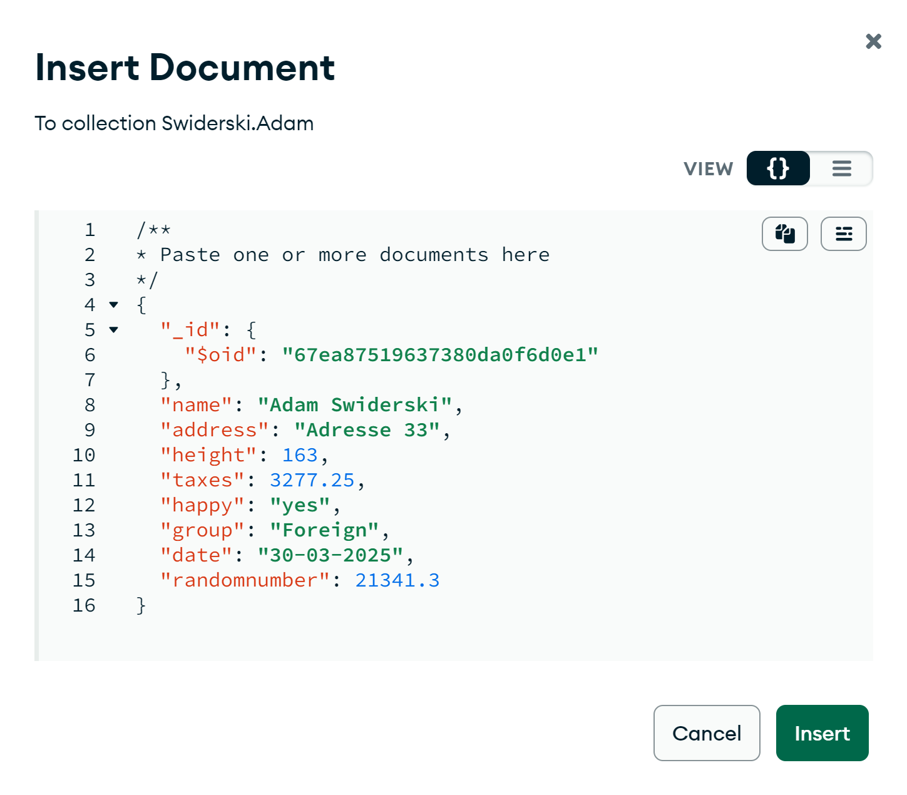
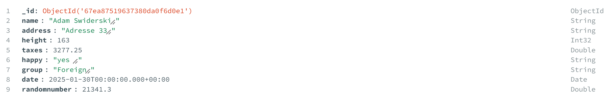
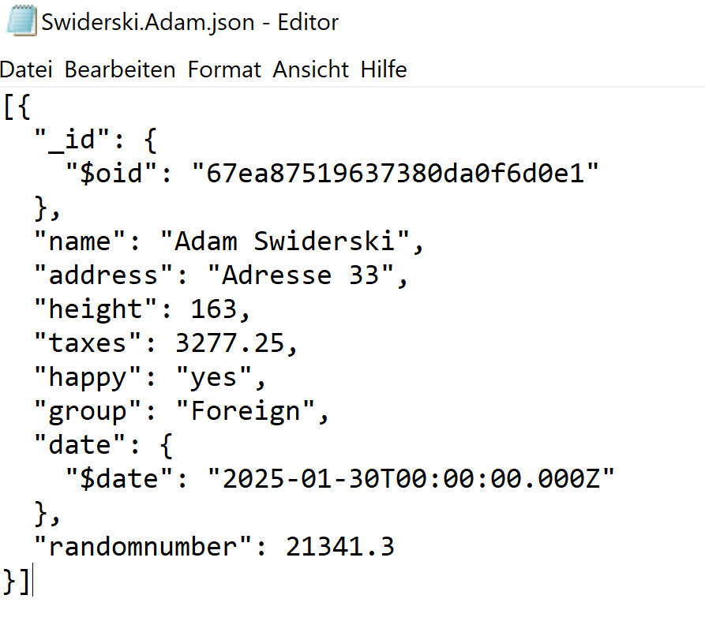
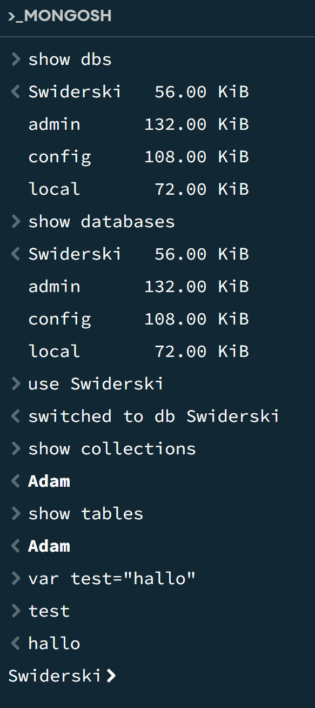
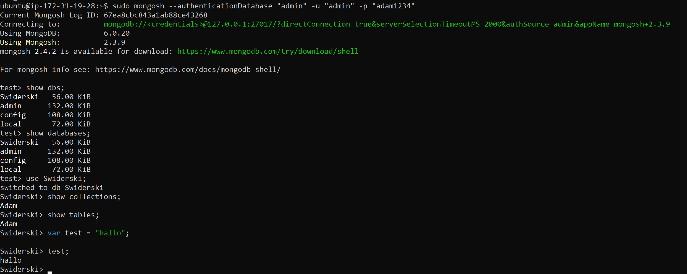

Wenn die Authentifizierungsdatenbank nicht mit der Datenbank übereinstimmt, mit der Sie eine Verbindung herstellen möchten, geben Sie die Authentifizierungsdatenbank mit dem authSourceParameter in der URL an.

"authSource=admin" sagt, dass die Authentifizierung in der "admin" Datenbank gespeichert ist. Das ist wichtig, weil der User "Admin" in der admin-Datenbank erstellt wurde. 

B)

Ich musste den Date als erstes in die klammern reintun, dann den vorgang wiederholen. Jedoch mit einem "$" Zeichen und das Datum im YYYY-MM-DD Format schreiben. 

C)

show dbs; -> Zeigt alle existierenden Datenbanken in MongoDB an.

show databases; -> Dasselbe wie show dbs;

use Swiderski; -> Wechselt in die Datenbank namens Swiderski.

show collections; -> Zeigt alle Collections in dieser DB.

show tables; -> Gleich wie show collections;

---
Tables:

speichern zeilen, definierte zeilen, struktur behalten

Collections:

speichert dokumente, meist dynamisch, flexibel

