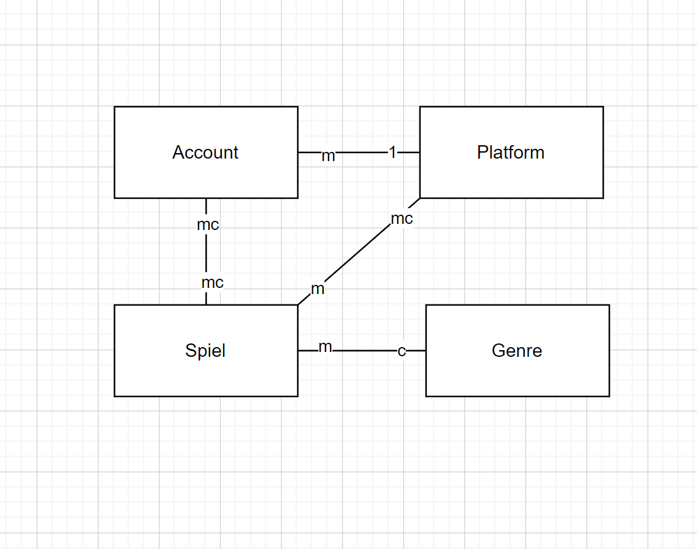
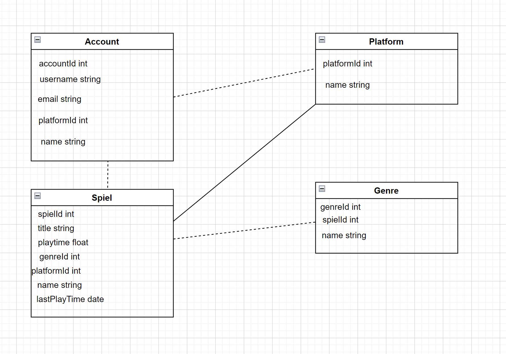

A)

Spiel - Account -> ein account kann mehr spiele haben, ein spiel kann mehrere accounts haben.

Platform - Account -> ein account gehört zu einer platform, eine platform hat mehrere accounts.

Spiel - Platform -> eine platform muss mehrere spiele haben, jedoch ein spiel kann auf mehreren platformen verfügbar sein.

Genre - Spiel -> ein spiel muss mindestens ein genre haben, ein genre kann mehrere spiele beinhalten.

B)

Warum sind Spiele im Account verschachtelt?
Weil sie wichtige Infos enthalten. So bleibt alles zusammen und ist effizient aufrufbar.

Warum sind Plattform und Genre im Spiel eingebettet?
Beides ändert sich selten und wird meistens gelesen.

Warum keine separaten Collections?
Wäre unnötig komplex. Die Verschachtelung hält die Struktur einfach und schnell verfügbar.
